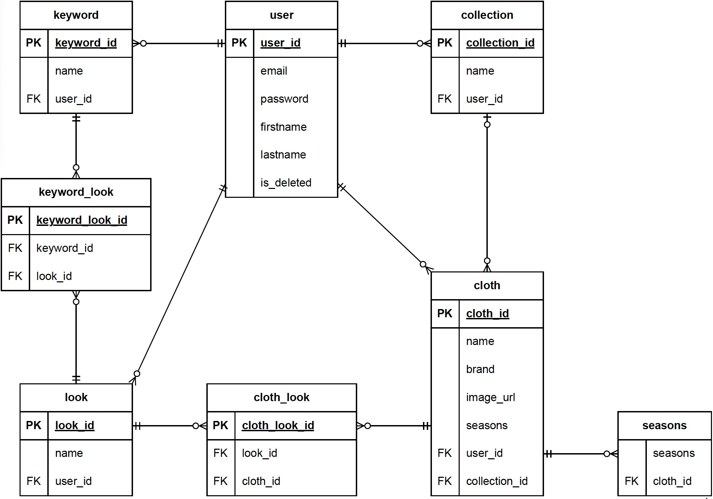

# My Wordrobe

## Project Summary

### About
**My Wardrobe** is a web application designed for users to efficiently organize and manage their clothing items.

### Key Features
- Catalog clothing items
- Search clothing items by name or brand
- Filter clothing items by seasons and collections
- Create a look by combining clothing items

### Built with
![java]
![spring]
![spring-boot]
![spring-security]
![jwt]
![h2]
![jpa-hibernate]

---

## Project Details

### File Structure
    .
    ├── src
    ├── gradle
    ├── .idea
    ├── gradlew
    ├── gradlew.bat
    ├── settings.gradle
    ├── build.gradle
    └── README.md

### Entity Relationship Diagram

### API Endpoints

**Auth**

`POST`: `/api/auth/register`

`POST`: `/api/auth/login`

**Users**

`GET`: `/api/users/{id}`

`GET`: `/api/users/{id}/clothes`

`GET`: `/api/users/{id}/collections`

`GET`: `/api/users/{id}/looks`

`GET`: `/api/users/{id}/keywords`

`PATCH`: `/api/users/{id}`

`DELETE`: `/api/users/{id}`

**Clothes**

`POST`: `/api/clothes`

`GET`: `/api/clothes/{id}`

`PATCH`: `/api/clothes/{id}`

`DELETE`: `/api/clothes/{id}`

**Collections**

`POST`: `/api/collections`

`GET`: `/api/collections/{id}`

`PATCH`: `/api/collections/{id}`

`DELETE`: `/api/collections/{id}`

**Looks**

`POST`: `/api/looks`

`GET`: `/api/looks/{id}`

`PATCH`: `/api/looks/{id}`

`DELETE`: `/api/looks/{id}`

**Keywords**

`POST`: `/api/keywords`

`GET`: `/api/keywords/{id}`

`PATCH`: `/api/keywords/{id}`

`DELETE`: `/api/keywords/{id}`

---

[java]: https://img.shields.io/badge/java-F8981D?style=for-the-badge&logoColor=white
[spring]: https://img.shields.io/badge/spring-6DB33F?style=for-the-badge&logo=spring&logoColor=white
[spring-boot]: https://img.shields.io/badge/spring%20boot-6DB33F?style=for-the-badge&logo=springboot&logoColor=white
[spring-security]: https://img.shields.io/badge/spring%20security-6DB33F?style=for-the-badge&logo=springsecurity&logoColor=white
[h2]: https://img.shields.io/badge/h2%20database-0000bb?style=for-the-badge&logoColor=white
[jpa-hibernate]: https://img.shields.io/badge/jpa%20hibernate-59666C?style=for-the-badge&logo=hibernate&logoColor=white
[jwt]: https://img.shields.io/badge/json%20web%20token-000000?style=for-the-badge&logo=jsonwebtokens&logoColor=white
